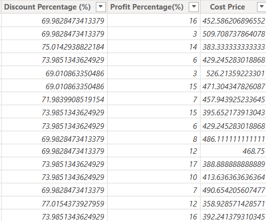
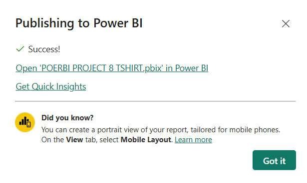
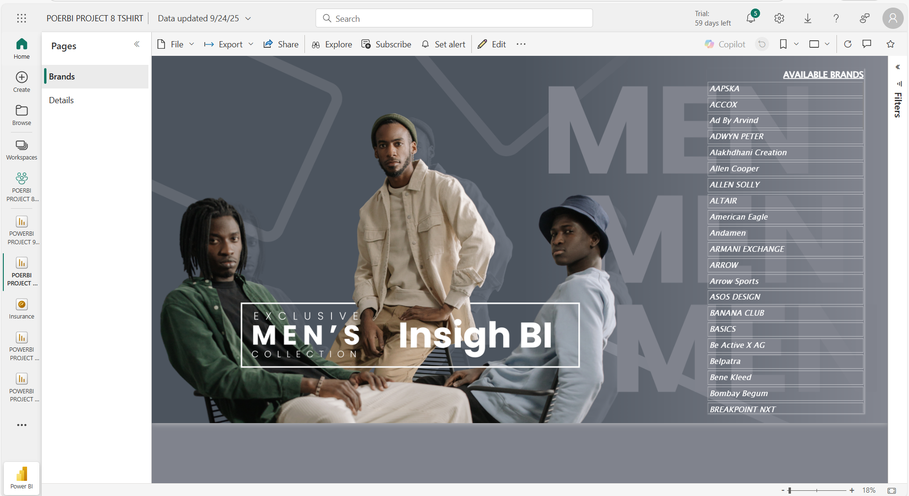

# T-Shirt Brand Analysis Dashboard

### Dashboard Link : https://app.powerbi.com/reportEmbed?reportId=8e9d66c5-cf67-4b4d-aa88-ea591a608cff&autoAuth=true&ctid=4190cc35-fd93-4aa6-9817-c1121132f7e2

## Problem Statement

This dashboard provides a detailed analysis of men’s T-shirt sales data by integrating Azure SQL Database with Power BI. The project involved cleaning raw sales data, engineering analytical metrics using SQL, Power Query, and DAX, and designing an interactive dashboard to evaluate brand-level performance. The analysis enables stakeholders to track discounting strategies, brand variety, premium pricing, and profit distribution to support informed business decisions.


## Steps Followed  

**Step 1:** The project began with the creation of an Azure SQL Database in the Azure Portal. A new resource group named *power BI* and a database called *test database* were configured, along with a SQL server (*testserverpowerbi*). Firewall rules were updated to allow client IP access, and the connection was established through SQL Server Management Studio (SSMS). The Men’s T-Shirts Sales CSV file was then imported using the *Import Flat File Wizard* and verified using SQL queries.  

**Step 2:** Data cleaning was carried out in Azure SQL to address quality issues. Unwanted leading characters (“?”) and trailing spaces in the *Original Price* and *Sales Price* columns were removed using SQL functions such as `REPLACE`, `TRIM`, and `CAST`. Post-cleaning validation was performed using `SELECT` queries to confirm the integrity of the dataset.  

**Step 3:** The cleaned dataset was connected to Power BI Desktop using the *Get Data > Azure SQL Database* option. Import mode was selected, authentication was completed with the database credentials, and the *dbo.MenTshirt* table was successfully loaded and reviewed in the Power BI table view.  

**Step 4:** Further transformation was performed in Power Query Editor. The *Original Price* and *Sales Price* columns were converted from text to decimal, and rows where both values were marked as “NA” were filtered out. An imputation logic was developed to address missing values: if *Original Price* was unavailable, the *Mark Price* was calculated as *Sales Price × 1.5*; otherwise, the *Mark Price* was set equal to the *Original Price*. Intermediate helper columns used in this process were removed to maintain a lean data model.  

**Step 5:** Analytical columns were engineered using DAX.   
- **Discount Percentage**  
  ```DAX
  Discount Percentage (%) = DIVIDE('MenTshirt'[Marked Price] - 'MenTshirt'[Sales Price], 'MenTshirt'[Marked Price])* 100

- **Profit Percentage (synthetic margins using random values)**
  ```DAX
  Profit % = RANDBETWEEN(2,17) 

- **Cost Price**
  ```DAX
  Cost Price = DIVIDE(100* 'MenTshirt'[Sales Price], 100+'MenTshirt'[Profit Percentage(%)])
All numerical columns were converted to decimal for consistency in mathematical operations.



**Step 6:** Page 1 of the report focused on a *Brands Overview*. A branded image and custom hex color were applied as the background, while the filter pane was removed to maintain a clean layout. A Multi-Row Card visual was added to display all available brands in bold white text with a scrolling feature, under the header *Available Brands*.  

**Step 7:** Page 2 of the report presented detailed brand insights. A stacked bar chart was created to showcase the *Top Five Brands by Average Discount Percentage*, with conditional formatting, bold labels, and a Top N filter.  

A donut chart displayed the *Top Five Brands by Variety of Styles*, based on the distinct count of titles.  

An area chart illustrated the *Top Five Brands by Average Profit Percentage*, with markers and data labels customized for clarity.  

A pie chart highlighted the *Bottom Five Brands by Average Profit Percentage*, with detailed labels inside slices and a simplified design for readability.  

**Step 8:** The report was finalized and published to the Power BI Service. Visuals were validated for interactivity, and consistent theming was maintained through the use of hex colors.


 
 # Report Snapshot (Power BI DESKTOP)

 



## Key Insights  

- The analysis of the Men’s T-Shirt sales dataset provides several important insights into brand performance.  

- The discount analysis shows that The Indian Garage Co. provides the highest average discount at 72 percent, followed by British Club at 67 percent and The Bear House at 62 percent. NETPLAY, on the other hand, offers the lowest discount among the top five brands at 32 percent. This highlights how certain brands rely heavily on discounting strategies to attract customers, while others maintain a premium positioning with fewer discounts.  

- In terms of profitability, SiliSoul, BASICS and The Souled Store  lead the market with average profit margins of 17 percent. Conversely, Be Active and AAPSKA records the lowest profitability at only 2 percent, while Terra Luna, Leriya Fashion, GESPO, Gant and Kingdom of White each remain at 3 percent. This contrast underlines how some brands are able to maintain strong cost and pricing strategies, while others struggle with efficiency.  

- When analyzing variety of styles, The Indian Garage Co. stands out by offering the widest range with 51 styles, which accounts for 22.87 percent of the share, followed by U.S. Polo Assn. with 44 styles (19.73 percent) and NETPLAY with 38 styles (17.04 percent). This suggests that variety plays a crucial role in strengthening brand presence, with The Indian Garage Co. and U.S. Polo Assn. clearly leading in product diversification.  

- From a pricing perspective, Armani Exchange holds the highest average sales price at 6.1K, followed by Brooks Brothers at 5.1K and Terra Luna at 5.0K. Kingdom of White is the lowest among the top five premium brands at 3.6K. This indicates that premium brands such as Armani Exchange and Brooks Brothers successfully command higher prices, reflecting their strong market positioning and brand value.   

- In conclusion, the dashboard highlights a clear distinction between brands that depend on discounts but sacrifice margins and those that sustain profitability or command premium pricing. Leaders such as The Indian Garage Co. dominate in terms of variety, while Armani Exchange and Brooks Brothers set themselves apart with premium pricing strategies. Underperforming brands, however, present opportunities for targeted interventions to enhance both profitability and market positioning.  

